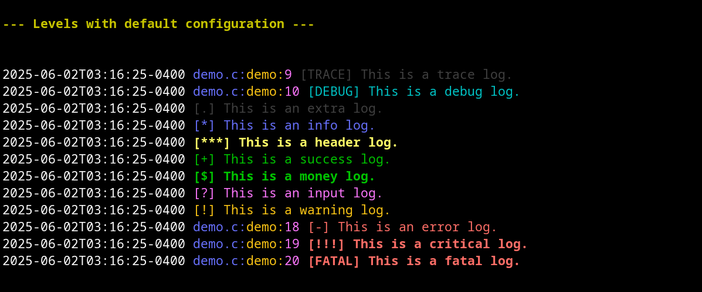

<p align="center">
  
</p>

Clog C Header - Simple C Header Logging Library
===============================================

Version: 1.0.1 ([Change Log](CHANGELOG.md))

Provides macros for color console and file logging.

Clog C Header is a C header library of functions that can be included in a
C project to provide colored printing and console and file logging macros.
These functions can be configured to allow versatility of compile-time
logging function inclusion.


Features
========

* Terminal color macros.
* Terminal color function macros.
* Normal file print function macros.
* File print line function macros.
* Colored file print function macros.
* Normal print function macros.
* Print line function macros
* Log level header print function macros.
* Colored print function macros.
* Colored print with line header function macros.
* Colored log level header print function macros.
* Console logging function macros.
* File logging function macros.
* Dual (console and file) logging function macros.
* Colored logging function macros.
* Logging with tracing function macros.
* Colored logging with tracing function macros.
* Logging with log level function macros.
* Colored logging with log level function macros.
* Logging with tracing and log level function macros.
* Colored Logging with tracing and log level function macros.
* Log level function alias macros.
* Timestamps in logging.
* Logging configuration options.
* Turn logging off and set level at compile time (can remove logging
from releases).


Images
======

<p align="center">
  
</p>
<p align="center">
  
</p>
<p align="center">
  
</p>
<p align="center">
  
</p>
<p align="center">
  
</p>
<p align="center">
  
</p>
<p align="center">
  
</p>


Philosophy
==========

This logging library provides functions that are grouped by letters that
indicate variations to the function behavior. The logs can be used during
development and then deactivated for release. Or they can be customized and
controlled by the developer.

The intent is to have a simple c header file that can be dropped into a
project or added to an include path that enables logging and colored printing
without configuration or additional setup unless specific configuration is
required.

This allows the developer to decide whether to compile logging into the
project or not by having the option to disable logging at compile time
using a configuration header or a simple preprocessor definition. The
developer can log all messages she or he wants and then disable logging for
a release they do not want logging enabled in). So a logging version of the
program will print and/or log all messages and a non-logging version will
have a smaller file size and no logging, but no changes to the source code
are needed.


Building & Installation
=======================

Dependencies and Requirements
-----------------------------

* Currently uses standard C library.

* Currently developed and tested in Linux environment with the gcc
compiler.

* (There are plans to extend functionality to support Windows and to
allow for a version that is not dependent on standard C library in the
future.)


Installation
------------

The `clog.h` header can be added to the include path of a project. But if you
want to install copies to your system (for systems with a `/usr/local/include`
directory like Linux), just run:

```
make install
```

This will install `clog.h` and `clog-colors.h` to `/usr/local/include`. For the
configuration, you will have to add a copy to each project you want to use it
on so that different projects can have different configurations.


### Building from Source

There is no building necessary (since Clog C Header is just a header library).
However, if you want to see the demo, you can run:

```
make               # If you want to see the demo. Not necessary to use.
```


Usage
=====

Simply include the header file in your project and start calling the print
and logging functions. To customize the filename, define `CLOG_FILE` before
the include statement for clog or edit it in the configuration example and
include the configuration before including the clog header.

To configure logging, use a separate configuration header file and include
BEFORE the clog header or make macro definitions before the include for the
log header file.

There are several "groups" of functions.

* "fprint" functions print to the given file pointer. The "f" stands for
"file" and indicates that the first argument is a C standard library file
pointer.

* "cfprint" functions print to the given file pointer in the given color.
The "c" stands for "color" and indicates that the first argument is a ANZI
color string (provided via constant macros) and the second argument is a C
standard library file pointer. The output has a color reset appended to the
end.

* "print" functions print to standard out. This group also includes a set
of "print_<level>" functions for printing with a leading level symbol
(called a line header in this documentation).

* "cprint" functions print to standard out in the given color. The "c"
stands for "color" and indicates that the first argument is a ANZI color
string (provided via constant macros). The output has a color reset
appended to the end. This group also has a set of "cprint_<level>"
functions that print a leading symbol before the message.

* "clog" functions print to standard error using predefined colors,
timestamps, and line headers and respond to log level and log color option
configurations. The "c" here stands for "console" (yeah, I know it breaks
the regular function rules -- it also stands for "color", but no color
argument is required). The output has a color reset appended to the
end. There are a series of "cclog" functions that allow for passing of a
color for the line if desired.

* "flog" functions print to a predefined file timestamps and line headers
and respond to log level configurations (colors are not used in file logs).
The "f" stands for "file", but no file argument is needed.

* "log" functions log to standard error and a file using predefined colors,
timestamps, and line headers (unless configured to do otherwise) and
respond to log level and log color configurations.

Each group has suffixes that determine the specific behavior of the
function.

* `<function>(s)` just outputs the given string `s`.

* `<function>LN(s)` outputs the given string `s` followed by a newline.

* `<function>F(s, ...)` outputs the given format string (just like
`printf`).

* `<function>FLN(s, ...)` outputs the given format string (just like
`printf`) followed by a newline.

* `<function><LN | F | FLN>_<level>(s)` follow the same rules described
above, but print a symbolic line header representing the level.

Macros with leading underscores (like `_<macro`) are not intended to be
used by the user.

Macro function definitions are all wrapped with brackets so they can be
used without brackets. For example, the following works:

    if (err)
        PERROR_ERROR("This is an error");

Since bracketing is used, if you use single line non-bracketed if else
statements, you will have to omit the semicolon. For example:

    if (err)
        LOGLN_ERROR("Oops.")  <---- notice missing semicolon for compiler.

    else
        LOGLN_SUCCESS("Yay!");

Since the macro functions are bracketed, the semicolon is not required. But
you can still use it, and it is recommended. For example, these statements
both work and are equivalent:

    PRINT("hello");
    PRINT("hello")

Additionally, since the functions are bracketed, you cannot use them as
rvalues. They do not have a return type. For example, you CANNOT:

    int x = PRINT("hello");

or:

    printf("%d", PRINT("hello"));


Configuration
=============

See [configuration](CONFIGURATION.md).


Examples
========

`PRINTFLN("Your number is %d.", 22);`

Output: "Your number is 22.\n"

`CPRINTLN(C_RED, "I am a red line.");`

Output: "I am a red line.\n" (in red text)

`PRINTF_INFO("Your number is %d.", 22);`

Output: "[*] Your number is 22" (no newline)

`CLOGLN("I am a console log.");`

Output: "2025-04-29T06:49:16-04:00 I am a console log\n"

`CLOGFLN_SUCCESS("Your number is %d.", 22);`

Output: "2025-04-29T06:49:16-04:00 [+] Your number is 22.\n"

`CLOGLN_DEBUG("Your number is %d.", 22);`

Output: "2025-04-29T06:49:16-04:00 [DEBUG] file.c:func:4: Your number is 22.\n"

`LOGFLN("Your number is %d.", 22);`

Output: "2025-04-29T06:49:16-04:00 Your number is 22.\n"
(In both console and file log)

[List of exported constants and functions](LIBRARY_API.md)


Future Plans
============

* Add support for multi-threading.
* Add print verbosity functionality.
* Add namespace mode (with defines in more limited namespace).
* Add color hex and string hex (#ffffff) conversion functions.
* Expand terminal color library to include italic, etc.
* Add option to set new log file instead of appending to file.
* Add exported symbols.
* Add python library.
* Add cpp library.
* Port to Windows.
* Need to consider backward compatability.
* Add automated testing.
* Consider reducing binary size with functions.
* Add optimizations for space or speed (need to benchmark functions).
* Add option for version that does not use libc.
* Consider adding dynamic functions version (rather than pure macros).

[Other TODOs](TODO.md)


#### [License](LICENSE)


